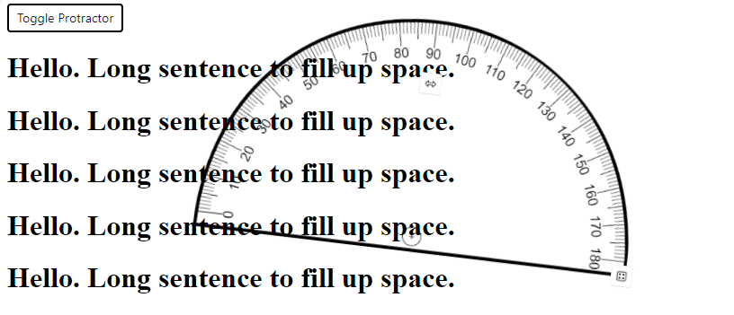

# <screen-protractor>

Puts a visible protractor on the screen that you can move, rotate, and scale with the mouse (and wheel), keyboard, or touch.

# <screen-protractor-button>

Puts a button the screen that toggles the protractor on and off.  It will reset the position when toggled.

Demo:  https://limefrogyank.github.io/screen-protractor/

Looks like this:

